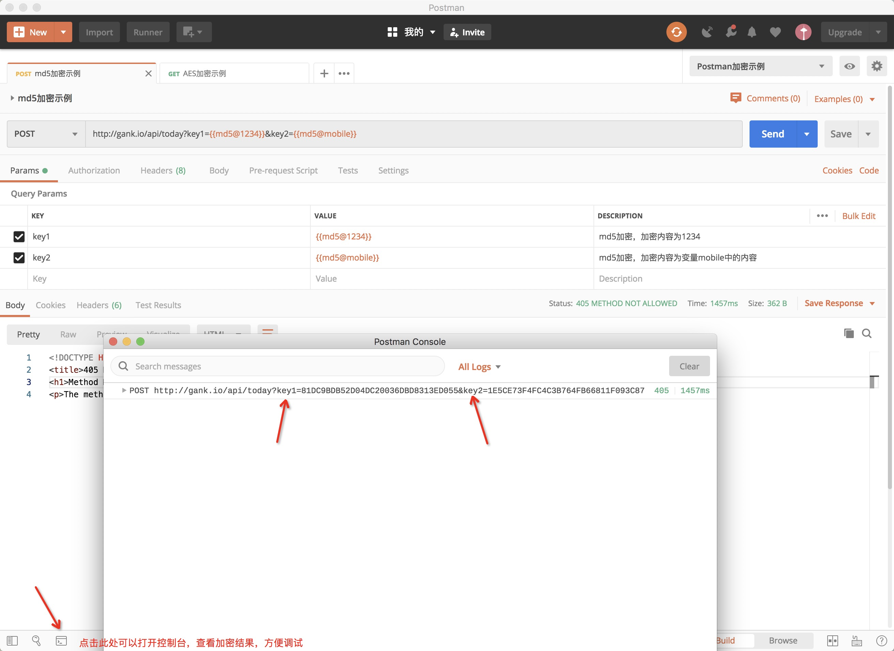

# Postman-encryption
Postman加密请求参数，支持AES, MD5，RSA...可自定加密方式.
> 微信号：onepiece2019

# 例子
下载本项目postman文件下的两个json文件, 分别为collections和环境变量，将其导入到Postman.
- Postman加密示例.postman_collection.json 导入到collection中
- Postman加密示例.postman_environment.json 导入到环境变量中

以下是用MD5加密的示例
<div align=center>

</div>

# 原理
Postman支持在Pre-request Script和Tests中编写Js脚本，并且内置了一些方法比如可以通过
```pm.environment.get(mobile)```来获取当前环境下mobile变量的内容，
而```pm.environment.set(key,value)```方法则可以动态变量的名称及内容.