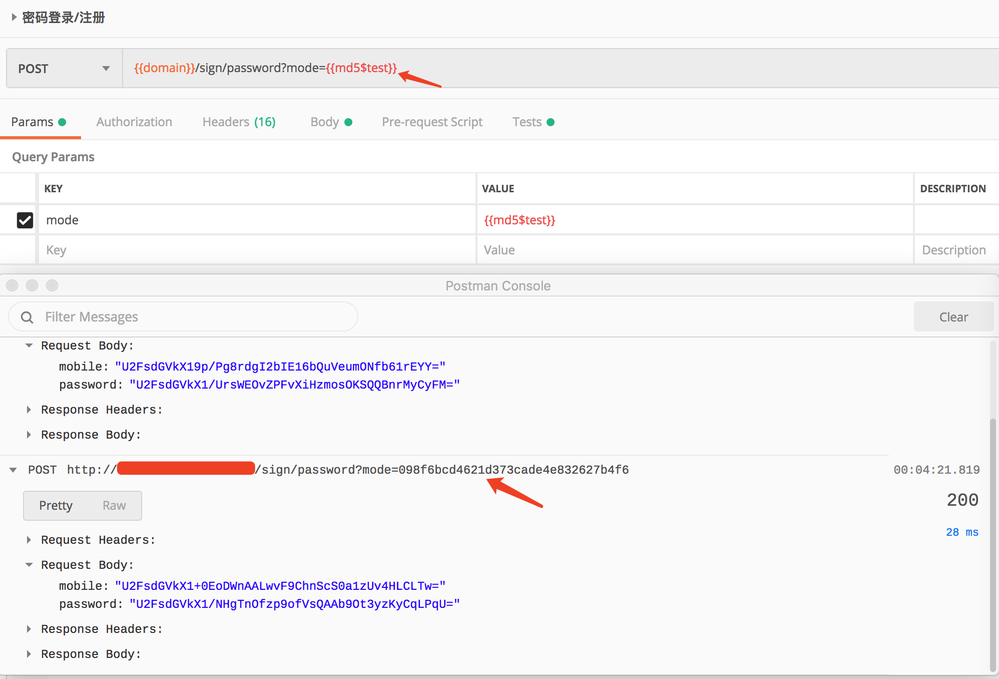
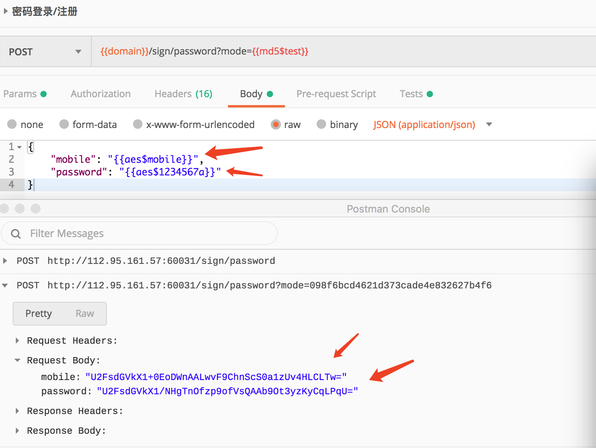
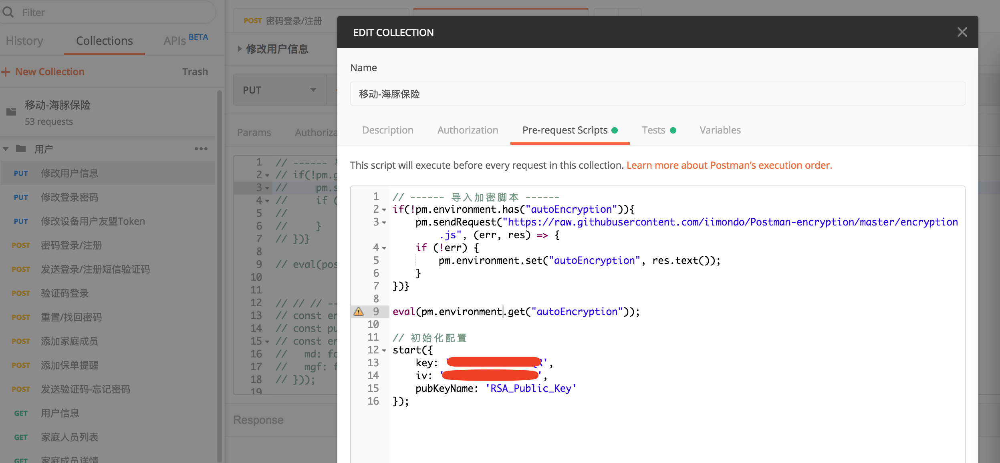

> 没有开放AES和RSA模式的接口, 如果你有需要或其他建议可以联系本人, QQ:1428728432

# Postman-encryption
Postman加密Pre-request Script

# 例子
- 用md5, 加密GET请求query参数
<div align=center>

</div>

- 用AES，加密Post请求中的Body, {{aes$mobile}}中的mobile是已有环境变量
<div align=center>

</div>

# 使用
### 1. 在Collections的Pre-request script添加
```
// ------ 导入加密脚本 ------
if(!pm.environment.has("encryption.js")){
    pm.sendRequest("https://raw.githubusercontent.com/iimondo/Postman-encryption/master/encryp/encryption_v2.js", (err, res) => {
    if (!err) {
        pm.environment.set("encryption.js", res.text());
    }
})}

eval(pm.environment.get("encryption.js"));

// 初始化配置
this.register({
    log: false, 
    splitter: "@", 
    key: 'Y5MU^OM7BUWI&BQR',
    iv: 'S4^AX&PFRFVJL73Z'
});
```
如下图：
<div align=center>

</div>

### 2. 在Collections的Tests中添加清除记录脚本
```
if(!pm.environment.has("clearTrace.js")){
    pm.sendRequest("https://raw.githubusercontent.com/iimondo/Postman-encryption/master/encryp/clearTrace.js", (err, res) => {
    if (!err) {
        pm.environment.set("clearTrace.js", res.text());
    }
})}

eval(pm.environment.get("clearTrace.js"));
```
Tests中的脚本是用来清除动态生成的环境变量，如果你想保留，可以不添加此脚本

### 3. 注意事项
- RSA公钥添加时必须首尾加上特殊字符，如下:<br>'-----BEGIN PUBLIC KEY-----\n' + pub_key + '-----END PUBLIC KEY-----'<br>
一般用户在登录后返回rsa的公钥，我们可以在登录接口的tests添加如下脚本：
```
const body = JSON.parse(responseBody);
if(body.code === 200){
    // 设置公钥
    pm.environment.set("RSA_Public_Key", 
    '-----BEGIN PUBLIC KEY-----\n' + body.data.pub_key + '-----END PUBLIC KEY-----');
}
```
当然如果你的公钥是存放在本地，则可以直接写死在环境变量中
- 加密使用的是[forge Project](https://github.com/digitalbazaar/forge)

# 配置参数说明
- key: AES的Key
- iv: AES的iv,即偏移量
- splitter: 分割符，区别加密模式和加密内容, 默认值 '@'
- privateKey: RSA私钥
- log: 是否开户日志

# 自定义自己的加密方式
继承AbsEncrypt， 重写overrder，然后返回你加密的结果
```
// 自定义加密方式
class DIY extends this.AbsEncrypt{
    constructor(splitter) {
        super('diy', splitter);
        this.timestamp;
    }
    
    overrder(data, raw){
        if(data === 'timestamp'){ // 获取时间
            this.timestamp = new Date().getTime();
            return this.timestamp.toString();

        } else if(data === 'merge'){ // 合并此前加密结果
            return env.CryptoJS.MD5(`iMlVF693Gz6eb7z1gzaccess_keyqDD09E51C16uoeIWtimespan${this.timestamp}iMlVF693Gz6eb7z1gz`).toString().toLocaleUpperCase();
        }

        return '';
    }
}


// 注册配置
this.register({
    log: false, 
    splitter: "@", 
    key: 'Y5MU^OM7BUWI&BQR',
    iv: 'S4^AX&PFRFVJL73Z'
}, [new DIY('@')]);
```